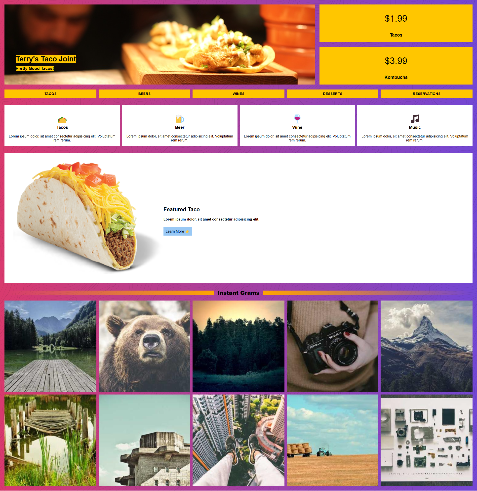

# 🌮 Terry's Taco Joint – CSS Grid Practice

Este proyecto es parte de una práctica del máster que estoy cursando, centrada en el uso de **CSS Grid** para construir diseños web modernos y responsivos.

> 💡 **Objetivo:** Aplicar los conceptos de CSS Grid creando una página visualmente atractiva y estructurada con múltiples secciones.

---

## 🧠 Lo que aprendí

- Organización de contenido usando **CSS Grid**
- Creación de secciones visualmente consistentes
- Uso de íconos, imágenes y tipografía para mejorar la experiencia del usuario
- Aplicación de colores llamativos y jerarquía visual

---

## 🔧 Tecnologías usadas

- HTML5
- CSS3 (con enfoque en **CSS Grid**)

---

## 🖼️ Vista previa

> *Una landing llamativa tipo restaurante con menús, secciones destacadas y una galería tipo Instagram.*

---

## 🧩 Estructura del sitio

- Barra de navegación con enlaces temáticos
- Sección de precios
- Categorías de productos (Tacos, Beer, Wine, etc.)
- Producto destacado
- Galería de imágenes ("Instant Grams")

---

## 🚀 Desafío superado

Este ejercicio fue un **gran reto**, especialmente al alinear todos los elementos de forma coherente usando solo CSS Grid. Fue una excelente oportunidad para poner en práctica la teoría con un diseño realista y divertido.

---

## 📁 Repositorio

Puedes ver el código completo aquí 👉 [GitHub - practica_cssgrid3](https://github.com/FrankJimenez79/practica_cssgrid3)
